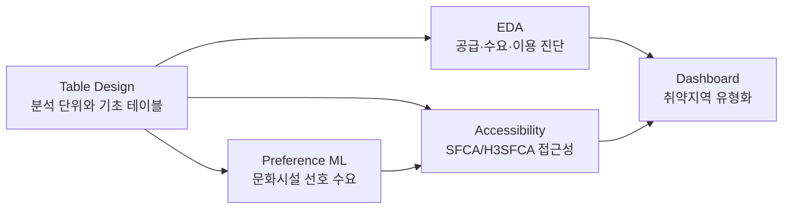

# Oracle MNC Project

문화누리카드 이용 데이터, 가맹점 데이터, 인구·교통·공간 데이터, 문화시설 선호도 데이터를 연결해 서울시 문화복지 접근성과 정책 우선지역을 분석한 최종 코드 모음입니다.

## Dashboard Demo

대시보드 시연을 원한다면? 📥 다운로드 [대시보드 공유 파일](https://github.com/JHPark-kor/Oracle-Project/raw/main/docs/share/mnc_dashboard_share.zip)

발표 자료는 여기에 📄 발표자료 PDF [발표 자료 pdf](https://github.com/JHPark-kor/Oracle-Project/blob/main/docs/share/%EC%98%A4%EB%9D%BC%ED%81%B4PPT_git.pdf)

## Project Goal

서울 안에서도 문화시설 공급, 이동 가능성, 대상자 수요, 개인 선호는 지역마다 다릅니다. 이 프로젝트는 문화누리카드 정책 대상자가 실제로 접근하기 어려운 지역을 찾기 위해 다음 질문을 코드로 검증합니다.

| Question | What We Built |
| --- | --- |
| 문화누리 수요는 어디에 집중되어 있는가? | 100m 격자 기반 추정 인구와 문화누리 대상자 수요 테이블 |
| 문화시설 공급은 수요와 맞게 배치되어 있는가? | 가맹점·일반 문화시설 마스터 테이블과 공급-이용 EDA |
| 이동 시간과 교통수단을 반영하면 접근성은 어떻게 달라지는가? | 도보·대중교통 네트워크와 SFCA/H3SFCA 접근성 지표 |
| 개인 선호를 반영하면 취약지역 우선순위가 바뀌는가? | 선호 수요 ML 모델과 선호 반영 접근성 지표 |
| 정책적으로 먼저 볼 지역은 어디인가? | 종합 문화취약지수, PCA 검토, KMeans/DBSCAN 취약권역 유형화 |

## Analysis Workflow



| Step | Topic | Code | Main Purpose |
| --- | --- | --- | --- |
| 1 | Table Design | [`notebooks/table_design/`](notebooks/table_design/) | 분석 격자, 추정 인구, 가맹점, 일반 문화시설, 네트워크 기초 테이블 생성 |
| 2 | EDA | [`notebooks/eda/`](notebooks/eda/) | 이용 현황, 공급-수요 불일치, 접근성-이용실적 상관 탐색 |
| 3 | Preference ML | [`notebooks/preference/`](notebooks/preference/) | 국민여가활동조사 기반 문화시설 선호 수요 모델 실험 |
| 4 | Accessibility | [`notebooks/access/`](notebooks/access/) | 공공 접근성, SFCA/H3SFCA, 장애인·고령자 접근성, 최종 취약지수 산출 |
| 5 | Dashboard | [`notebooks/dashboard/`](notebooks/dashboard/) | 취약지수 대시보드 입력 데이터와 취약권역 군집화 코드 |

## Code Shortcut

발표 중 특정 분석 단계의 코드를 확인할 때는 아래 폴더로 바로 이동하면 됩니다.

| If You Want To See | Open This | Key Files |
| --- | --- | --- |
| 분석 테이블이 만들어지는 과정 | [`notebooks/table_design/`](notebooks/table_design/) | `01_demand_grid.ipynb`, `03_estimated_mnc.ipynb`, `04_mnc_store_master.ipynb`, `05_walk_transport_network.ipynb` |
| EDA와 문제 정의 근거 | [`notebooks/eda/`](notebooks/eda/) | `01_middle_cat_correlation.ipynb`, `02_sub_cat_correlation.ipynb`, `03_government_10km_demographic_eda.ipynb` |
| 접근성 지표와 취약지수 | [`notebooks/access/`](notebooks/access/) | `03_h3sfca.ipynb`, `05_h3sfca_sensitivity.ipynb`, `07_final_vulnerability_index.ipynb`, `09_correlation_comparison.ipynb` |
| 문화시설 선호 수요 ML | [`notebooks/preference/ML/`](notebooks/preference/ML/) | `preference/`, `satisfaction/` |
| 대시보드와 정책 우선지역 유형화 | [`notebooks/dashboard/`](notebooks/dashboard/) | `01_vulnerability_index_build.ipynb`, `03_vulnerability_region_kmeans.ipynb`, `04_h3sfca_category_dbscan.py` |
| 데이터 출처와 폴더 관리 기준 | [`metadata/data_metadata.md`](metadata/data_metadata.md), [`docs/folder_guide.md`](docs/folder_guide.md) | 데이터 설명, 제외 파일 기준 |

## Presentation PDF

발표자료 PDF는 최종본 완성 후 이 위치에 추가할 예정입니다.

| Material | Link |
| --- | --- |
| Final Presentation PDF | `docs/presentation.pdf` 예정 |

## Repository Structure

```text
oracle_mnc_project/
├── README.md
├── requirements.txt
├── metadata/
│   └── data_metadata.md
├── docs/
│   ├── folder_guide.md
│   ├── team_setup_guide.md
│   └── share/
│       └── mnc_dashboard_share.zip
├── data/
│   ├── raw/
│   ├── interim/
│   └── processed/
├── models/                  # 검토된 경량 모델 전달 산출물
├── scripts/                 # 로컬·Oracle 적재·검증 실행 코드
├── src/                     # 분석 로직과 데이터 접근 계층
├── tests/                   # 자동 검증
└── notebooks/
    ├── table_design/
    │   └── docs/
    ├── eda/
    │   └── docs/
    ├── access/
    │   └── docs/
    ├── preference/
    │   ├── docs/
    │   └── ML/
    │       ├── preference/
    │       └── satisfaction/
    └── dashboard/
        └── docs/
```

## Notebook Map

### Table Design

분석에 필요한 기본 테이블을 만드는 코드입니다.

| File | Role |
| --- | --- |
| [`01_demand_grid.ipynb`](notebooks/table_design/01_demand_grid.ipynb) | 행정동 수요를 100m 격자 분석 단위로 연결 |
| [`02_estimated_grid.ipynb`](notebooks/table_design/02_estimated_grid.ipynb) | 100m 격자 추정 인구 산출 |
| [`03_estimated_mnc.ipynb`](notebooks/table_design/03_estimated_mnc.ipynb) | 문화누리 대상자 격자 수요 추정 |
| [`04_mnc_store_master.ipynb`](notebooks/table_design/04_mnc_store_master.ipynb) | 문화누리 가맹점 마스터 테이블 생성 |
| [`05_walk_transport_network.ipynb`](notebooks/table_design/05_walk_transport_network.ipynb) | 서울 도보·대중교통 접근성 네트워크 테이블 생성 |
| [`06_walk_transport_network_competition_25km.ipynb`](notebooks/table_design/06_walk_transport_network_competition_25km.ipynb) | 서울 외부 25km 경쟁권 네트워크 접근성 테이블 생성 |
| [`07_grid_population_specific.ipynb`](notebooks/table_design/07_grid_population_specific.ipynb) | 성별·연령·장애 여부별 격자 수요 세분화 |
| [`08_general_facility_master.ipynb`](notebooks/table_design/08_general_facility_master.ipynb) | 일반 문화시설 마스터 테이블 생성 |
| [`09_incheon_gyeonggi_area_clip.ipynb`](notebooks/table_design/09_incheon_gyeonggi_area_clip.ipynb) | 인천·경기 외부 25km 분석권역 및 격자 처리 |

### EDA

문제 정의와 지표 설계 전 단계의 탐색 코드입니다.

| File | Role |
| --- | --- |
| [`eda_01_annual_usage_diversity.py`](notebooks/eda/eda_01_annual_usage_diversity.py) | 연도별 이용 및 카테고리 다양성 진단 |
| [`eda_02_district_usage_supply_diagnostic.py`](notebooks/eda/eda_02_district_usage_supply_diagnostic.py) | 자치구별 이용·공급 종합 진단 |
| [`eda_03_category_usage_supply_gap.py`](notebooks/eda/eda_03_category_usage_supply_gap.py) | 분야별 이용-공급 불일치 후보 탐색 |
| [`eda_04_supply_utilization_sensitivity.py`](notebooks/eda/eda_04_supply_utilization_sensitivity.py) | 공급량과 이용률 상관 민감도 분석 |
| [`01_middle_cat_correlation.ipynb`](notebooks/eda/01_middle_cat_correlation.ipynb) | 중분류 접근성-이용실적 상관 분석 |
| [`02_sub_cat_correlation.ipynb`](notebooks/eda/02_sub_cat_correlation.ipynb) | 소분류 접근성-이용실적 상관 분석 |
| [`03_government_10km_demographic_eda.ipynb`](notebooks/eda/03_government_10km_demographic_eda.ipynb) | 공공기관식 10km 기준과 인구특성 EDA |

### Accessibility

접근성 지표와 최종 취약지수를 만드는 핵심 분석 코드입니다.

| File | Role |
| --- | --- |
| [`01_public_access_index.ipynb`](notebooks/access/01_public_access_index.ipynb) | 일반 문화시설 공공 접근성 지표 재구성 |
| [`02_public_access_table.ipynb`](notebooks/access/02_public_access_table.ipynb) | 일반 문화시설 접근성 분석 테이블 생성 |
| [`03_h3sfca.ipynb`](notebooks/access/03_h3sfca.ipynb) | 선호 미반영 SFCA와 선호 반영 H3SFCA 분석 |
| [`04_disability_elderly_e2sfca.ipynb`](notebooks/access/04_disability_elderly_e2sfca.ipynb) | 장애인·고령자 400m E2SFCA 접근성 |
| [`04_1_disability_elderly_mode_consistent_e2sfca.ipynb`](notebooks/access/04_1_disability_elderly_mode_consistent_e2sfca.ipynb) | 교통수단 기준을 맞춘 장애인·고령자 접근성 |
| [`05_h3sfca_sensitivity.ipynb`](notebooks/access/05_h3sfca_sensitivity.ipynb) | H3SFCA 가중치·시나리오 민감도 검증 |
| [`06_compare_index.ipynb`](notebooks/access/06_compare_index.ipynb) | 접근성 지표와 이용실적 비교 |
| [`07_final_vulnerability_index.ipynb`](notebooks/access/07_final_vulnerability_index.ipynb) | 종합 문화취약지수 산출 |
| [`08_vulnerability_index_pca.ipynb`](notebooks/access/08_vulnerability_index_pca.ipynb) | PCA 기반 취약지수 검토 |
| [`09_correlation_comparison.ipynb`](notebooks/access/09_correlation_comparison.ipynb) | 접근성 지표별 이용실적 상관 비교 |

### Preference ML

문화시설 분류별 선호 확률을 만들기 위한 ML 실험 코드입니다.

| Folder | Role |
| --- | --- |
| [`ML/preference/`](notebooks/preference/ML/preference/) | 향후 희망 여가활동 기반 선호 수요 모델 실험 |
| [`ML/satisfaction/`](notebooks/preference/ML/satisfaction/) | 가장 만족스러운 여가활동 기반 비교 모델 실험 |
| [`docs/`](notebooks/preference/docs/) | 선호 수요 모델링 데이터와 전처리 설명 |

### Dashboard

최종 정책 활용 단계의 코드입니다.

| File | Role |
| --- | --- |
| [`01_vulnerability_index_build.ipynb`](notebooks/dashboard/01_vulnerability_index_build.ipynb) | 대시보드용 최종 취약지수 테이블 생성 |
| [`02_dashboard_data_build.ipynb`](notebooks/dashboard/02_dashboard_data_build.ipynb) | 대시보드 입력 데이터 구성 |
| [`03_vulnerability_region_kmeans.ipynb`](notebooks/dashboard/03_vulnerability_region_kmeans.ipynb) | KMeans 기반 취약권역 유형화 |
| [`04_h3sfca_category_dbscan.py`](notebooks/dashboard/04_h3sfca_category_dbscan.py) | H3SFCA 분류별 DBSCAN 취약권역 탐색 |
| [`DBSCAN_profiling.ipynb`](notebooks/dashboard/DBSCAN_profiling.ipynb) | DBSCAN 취약권역 프로파일 확인 |

## Data Policy

- `data/`, `analysis_table/`, `OUTPUT/`, `IMAGE/`, `output/`, `outputs/`는 GitHub에 올리지 않습니다.
- `data/` 폴더는 구조 안내용 `.gitkeep`만 추적합니다.
- 로컬 실행용 원천 데이터는 [`metadata/data_metadata.md`](metadata/data_metadata.md)의 경로 기준으로 배치합니다.
- 기존 작업 중 사용한 `analysis_table/` 폴더는 로컬 데이터 보관 위치로만 남기고, 최종 GitHub 구조에서는 제외합니다.
- 일부 notebook의 `analysis_table/data/...` 참조는 기존 로컬 데이터 경로와의 실행 호환을 위한 것이며, 해당 데이터는 추적하지 않습니다.
- 노트북 output은 커밋하지 않습니다. 결과 이미지는 발표자료나 별도 공유 폴더에서 관리합니다.
- 단, 발표 시연용 최종 대시보드는 `docs/share/mnc_dashboard_share.zip`만 예외적으로 포함합니다.
- `.env`, Wallet, 비밀번호, OCI 인증 파일은 절대 Git에 커밋하지 않습니다.
- `models/`에는 행 단위 원본 없이 입력 계약·클래스 순서·버전·체크섬을 갖춘 검토된 경량 산출물만 두어야 합니다.

## Data Backend

기존 로컬 파일 방식이 기본입니다. `DATA_BACKEND=oracle`을 명시한 실행에서만 Oracle MNCDEV를 사용합니다. 두 방식은 같은 전처리·계산 로직을 공유하며, Oracle 이전 전후 결과는 보존 검증으로 비교합니다.

## Getting Started

```powershell
git clone https://github.com/JHPark-kor/Oracle-Project.git
cd Oracle-Project
python -m venv .venv
.\.venv\Scripts\activate
pip install -r requirements.txt
```

데이터를 로컬에 배치한 뒤 `notebooks/table_design/`부터 순서대로 실행하면 접근성 분석과 최종 취약지수 코드 흐름을 확인할 수 있습니다.

## Documents

| Document | Purpose |
| --- | --- |
| [`docs/oci_quickstart.md`](docs/oci_quickstart.md) | OCI MNCDEV·Wallet·VS Code 연결과 로컬/Oracle 전환 방법 |
| [`metadata/data_metadata.md`](metadata/data_metadata.md) | 원천 데이터 경로와 설명 |
| [`docs/folder_guide.md`](docs/folder_guide.md) | 폴더별 사용 기준과 GitHub 제외 항목 |
| [`docs/team_setup_guide.md`](docs/team_setup_guide.md) | 협업 및 실행 환경 가이드 |
| [`docs/preference_analysis.md`](docs/preference_analysis.md) | 만족활동 기반 선호예측·공간 적용 실행 및 해석 |
| [`models/preference_analysis/v1/README.md`](models/preference_analysis/v1/README.md) | 팀 전달용 선호모델·H3SFCA 결합 계약 |
